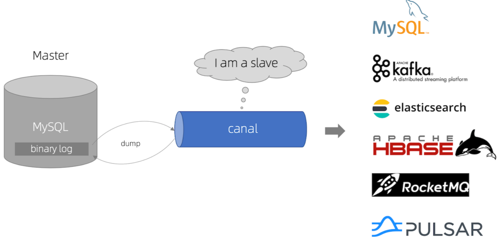

# 聚合搜索平台后端

### 主流框架 & 特性

- Spring Boot 2.7.x
- Spring MVC
- MyBatis + MyBatis Plus 数据访问（开启分页）
- Spring Boot 调试工具和项目处理器
- Spring AOP 切面编程
- Spring Scheduler 定时任务
- Spring 事务注解

### 数据存储

- MySQL 数据库
- Elasticsearch 搜索引擎

### 工具类

- Easy Excel 表格处理
- Hutool 工具库
- Gson 解析库
- Apache Commons Lang3 工具类
- Lombok 注解

### 业务特性

- 全局请求响应拦截器（记录日志）
- 全局异常处理器
- 自定义错误码
- 封装通用响应类
- Swagger + Knife4j 接口文档
- 自定义权限注解 + 全局校验
- 全局跨域处理

## 业务功能

- 数据库检索、ES 灵活检索
- HttpClient离线获取目标网站文章
- jsoup作爬虫工具爬取bing图片
- css selector解析图片数据
- 文章全量同步 ES、增量同步 ES 定时任务

### 单元测试

- JUnit5 单元测试
- 示例单元测试类


### MySQL 数据库

1）修改 `application.yml` 的数据库配置为你自己的：

```yml
spring:
  datasource:
    driver-class-name: com.mysql.cj.jdbc.Driver
    url: jdbc:mysql://localhost:3306/my_db
    username: root
    password: root
```

2）执行 `sql/create_table.sql` 中的数据库语句，自动创建库表

3）启动项目，访问 `http://localhost:8101/api/doc.html` 即可打开接口文档，不需要写前端就能在线调试接口了~


### Elasticsearch 搜索引擎

https://www.elastic.co/cn/downloads/elasticsearch

1）修改 `application.yml` 的 Elasticsearch 配置为你自己的：

```yml
spring:
  elasticsearch:
    uris: http://localhost:9200
    username: root
    password: 123456
```

2）复制 `sql/post_es_mapping.json` 文件中的内容，通过调用 Elasticsearch 的接口或者 Kibana Dev Tools 来创建索引（相当于数据库建表）

```
PUT post_v1
{
 参数见 sql/post_es_mapping.json 文件
}
```

这步不会操作的话需要补充下 Elasticsearch 的知识，或者自行百度一下~

3）开启同步任务，将数据库的帖子同步到 Elasticsearch

找到 job 目录下的 `FullSyncPostToEs` 和 `IncSyncPostToEs` 文件，取消掉 `@Component` 注解的注释，再次执行程序即可触发同步：


```java
// todo 取消注释开启任务
//@Component
```
4）ik分词

https://github.com/medcl/elasticsearch-analysis-ik/tree/master/config

https://github.com/medcl/elasticsearch-analysis-ik


### Canal
https://github.com/alibaba/canal/
````
数据库每次修改时会修改binary log文件，使用canal监听该文件的修改，可以及时获取数据并处理
````

https://github.com/alibaba/canal/wiki/QuickStart

Windows下找到本地MySQL安装目录，在根目录下创建my.ini文件：
````
[mysq1d]
log- bin=mysql-bin #开启binlog
binlog- format=ROW #选择ROW
模式
server_ id=1 #配置MySQL replaction 需要定义，不要和canal的slaveId 重复
````
Java找不到，修改startup.bat脚本为自己的JavaHome
````
set JAVA_ HOME= D:\environment\local\jdk1.8.0_152
echo %JAVA_ HOME%
set PATH=%JAVA_ HOME%\bin;%PATH%
echo %PATH%
````
#### mysql8.0+通过canal1.1.6监听数据库数据修改的问题
- mysql8.0.3后身份检验方式为caching_sha2_password，但canal使用的是mysql_native_password，因此需要设置检验方式（如果该版本之前的可跳过），否则会报错IOException: caching_sha2_password Auth failed；
````
ALTER USER 'canal'@'%' IDENTIFIED WITH mysql_native_password BY 'canal';
select host,user,plugin from mysql.user ;
````
- canal 1.1.6 lib中MySQL驱动器为5.x版本；
````
将canal lib中的驱动器替换成mysql-connector-java-8+.jar；
修改驱动器权限：
chmod 777 lib/mysql-connector-java-8.0.22.jar
chmod +st lib/mysql-connector-java-8.0.22.jar；
删除原5.+版本驱动器，重启服务；
````


### 跨域处理
#### 单个请求跨域处理
```Java

//可以在指定的Controller或方法添加注解@CrossOrigin
//直接加上述注解会放行所有请求
/*
    @Deprecated
    String[] DEFAULT_ORIGINS = new String[]{"*"};
    @Deprecated
    String[] DEFAULT_ALLOWED_HEADERS = new String[]{"*"};
*/
//在注解内添加指定参数    
```
#### 全局跨域处理
```Java
//封装跨域请求配置类
//package --config
//class --CorsConfig

```
https://juejin.cn/post/7201475476165328953

````java
//todo 模拟第三方数据源接入

````
